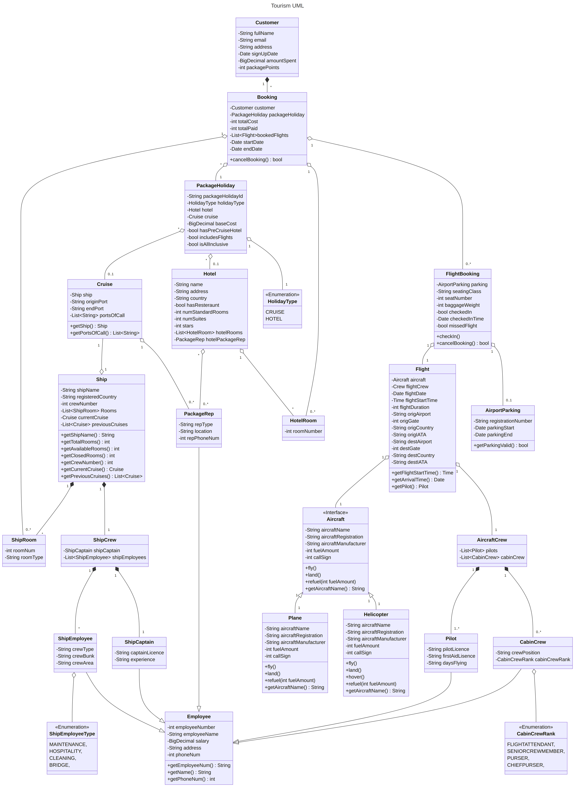

# Program UML

{height=85%}

First areas of testing.

The first stages of testing will ocurr during the development and programming process. The project
will make extensive use of unit tests; these tests involve writing isolated automated tests
that target small sections of the program, known as units.

Creation of the unit test involves developing a criteria, refered to the test case.

The unit returns output
that is compared to the test's criteria that is known to be correct by the developers.

Ensuring that these small units of the program correct

Testing lots of small units that integrate to form a complex program reduces the amount of uncertain 
variables compared to a large monolithic test of the end result.

Furthermore,

Within this project, the Java unit testing framework JUnit will be used.

Building on top of unit testing, continuous integration ensures that all developers within the
organisation 

- feature flags
- ui testing
- test lab
- testing pyramid
- e2e testing - operational - max interaction - require running services - automated ui testing server
- integration testing - testing api code inteactions, database connection 
- black box testing - less interaction - 
- martin folwer testing articles

