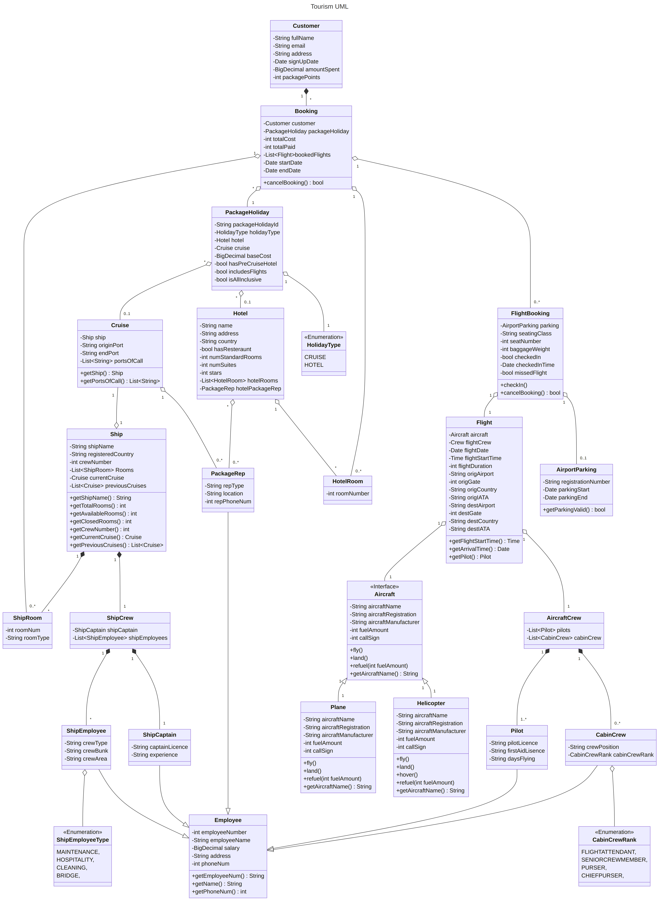

---
title: "IS1S481 Coursework 2"
author: [Jake Real - 23056792]
date: "01/03/2024"
toc-own-page: true
# titlepage: true
# titlepage-background: "title-background.pdf"
bibliography: "references.bib"
csl: "university-of-south-wales-harvard.csl"

# Program UML

{height=85%}

First areas of testing.


The first stages of testing will ocurr during the development and programming process. The project
will make extensive use of unit tests; these tests involve writing isolated automated tests
that target small sections of the program, known as units.

Creation of the unit test involves developing a criteria, refered to the test case.

The unit returns output
that is compared to the test's criteria that is known to be correct by the developers.

Ensuring that these small units of the program correct

Testing lots of small units that integrate to form a complex program reduces the amount of uncertain 
variables compared to a large monolithic test of the end result.

Furthermore,

Within this project, the Java unit testing framework JUnit will be used.

Building on top of unit testing, continuous integration ensures that all developers within the
organisation:

- feature flags
- ui testing
- test lab
- testing pyramid
- e2e testing - operational - max interaction - require running services - automated ui testing server
- integration testing - testing api code inteactions, database connection 
- black box testing - less interaction - 
- martin folwer testing articles

Should the service require any external API's. These could be tracking APIs offered by various airports,
or apis offered by the FIA (British equiavalent) to ensure that planes are correctly en route.
Then the implementation of contact testing can ensure that updates to API returns and intefaces are
quickly recognised and corrected. To ensure that the service does not suffer for too long.

End to end user testing. 


`JUnit5` test for checking in process in `FlightBooking.java`,

```java
public boolean checkIn() {
    if (LocalDateTime.now().isAfter(flight.getFlightStart())) {
        hasMissedFlight = true;
        return false;
    }
    hasCheckedIn = true;
    checkInTime = LocalDateTime.now();
    return true;
}
```

The unit test created to test the `checkIn` method in the `FlightBooking` class.

```java
import org.junit.jupiter.api.DisplayName;
import org.junit.jupiter.api.Test;
import org.mockito.Mockito;

import java.time.LocalDateTime;

import static org.junit.jupiter.api.Assertions.assertFalse;
import static org.junit.jupiter.api.Assertions.assertTrue;

class FlightBookingTest {
    private Flight testFlight;
    private FlightBooking testFlightBooking;


    @Test
    @DisplayName("Check-in process with an on-time flight booking")
    public void checkIn() {
        LocalDateTime earlyDateTime = LocalDateTime.now().plusYears(1);
        /*
         Create a mocked class of testFlight testFlight could use 
         an API for plane tracking, so creating a stub ensures that
         the test is independent
        */
        testFlight = Mockito.mock(Flight.class);
        // Set what to return when getFlightStart() is called
        Mockito.when(testFlight.getFlightStart()).thenReturn(
            earlyDateTime
        );

        // Call the check-in process
        testFlightBooking = new FlightBooking(
            testFlight, "economy", 12, 200
        );
        assertTrue(testFlightBooking.checkIn());
    }

    @Test
    @DisplayName("Check-in process with a late flight booking")
    public void checkInLate() {
        LocalDateTime lateDateTime = LocalDateTime.now().minusYears(1);

        // Create another mocked class
        testFlight = Mockito.mock(Flight.class);
        // Set return time to the future to fail check-in
        Mockito.when(testFlight.getFlightStart()).thenReturn(
            lateDateTime
        );

        // Call the check-in process
        testFlightBooking = new FlightBooking(
            testFlight, "economy", 12, 200
        );
        assertFalse(testFlightBooking.checkIn());
    }
}
```

Narrow integration test with a PostgreSQL database.

```java
import org.junit.jupiter.api.Test;
import org.junit.jupiter.api.AfterAll;
import org.junit.jupiter.api.BeforeAll;
import org.junit.jupiter.api.BeforeEach;
import org.junit.jupiter.api.DisplayName;
import org.testcontainers.containers.PostgreSQLContainer;


/**
 * Test the program's integration with a database
 */
public class CustomerIntegrationTest {

    /*
     Create a temporary database container to test a database's 
     integration with the program
    */
    static PostgreSQLContainer<?> postgres = 
        new PostgreSQLContainer<>("postgres:16-alpine");

    Customer customer;
    // CustomerDatabase customerDatabase;

    /**
     * Start the database
     */
    @BeforeAll
    public static void startContainer() {
        postgres.start();
    }

    /**
     * Stop the database container
     */
    @AfterAll
    public static void stopContainer() {
        postgres.stop();
    }

    /**
     * Connect to the database and proceed to clean it of previous
     * entries
     */
    @BeforeEach
    public void setUpCleanDb() {
        customerDatabase = new CustomerDatabase(postgres.getJbdcUrl());
        customerDatabase.deleteAll();
    }

    /**
     * Test that {@code customerDatabase} integrates with and adds
     * the customer to the database
     */
    @Test
    @DisplayName("Database create customer")
    public void dbCreateCustomer() {
        customer = new Customer("Jake Real", "jakeemail@email.com",
            "3 Cool Road, Swandiff"
        );
        // Add the created customer to the database
        customerDatabase.addCustomer(customer)
        // Test that customer was created in the database
        assertEquals("Jake Real", customerDatabase.getCustomerByName(
            "Jake Real").getFullName()
        );
    }

    /**
     * Test that {@code customerDatabase} integrates with and deletes
     * the customer from the database
     */
    @Test
    @DisplayName("Database delete customer")
    public void dbDeleteCustomer() {
        customer = new Customer("Jake Real", "jakeemail@email.com", 
            "3 Cool Road, Swandiff"
        );
        // Add the created customer to the database
        customerDatabase.addCustomer(customer);
        // Test that customer was created in the database
        assertEquals("Jake Real", customerDatabase.getCustomerByName(
            "Jake Real").getFullName()
        );
        // Delete the customer from the database
        customerDatabase.deleteCustomerById(customer.getId);
        // Check that there are no customers
        assertEquals(0, customerDatabase.getAllCustomers().size());
    }

}
```


